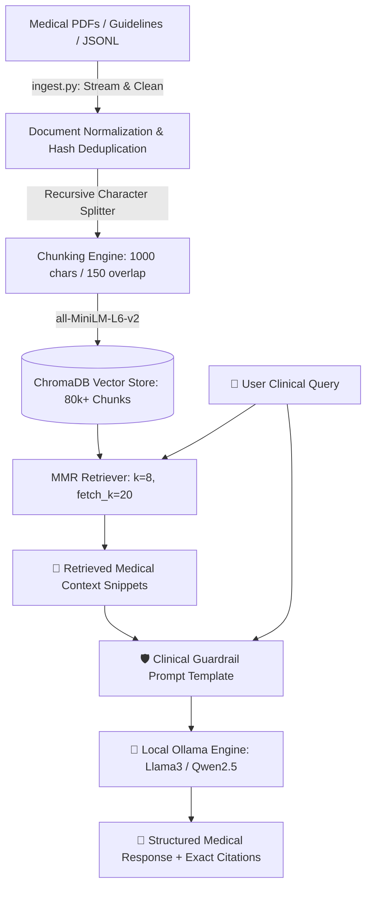

# 🩺 Emergency Medical Assistance — 100% Local Medical RAG LLM

[](https://www.python.org/)
[](https://www.langchain.com/)
[](https://www.trychroma.com/)
[](https://ollama.ai/)
[](https://streamlit.io/)
[](https://github.com/explodinggradients/ragas)

An **enterprise-grade, privacy-first, 100% local Retrieval-Augmented Generation (RAG) system** engineered for emergency clinical triage, first-aid guidance, and medical literature query answering. Powered entirely on local hardware with zero external API calls or data leakage.

---

## 🌟 Key Highlights

- **🔒 100% Local & Privacy-Preserving:** Operates fully offline using Ollama (`qwen2.5-coder`, `llama3`, `mistral`) and local HuggingFace embeddings. Zero medical data leaves the local environment.
- **⚡ Vector-Accelerated Semantic Search:** Indexed with **80,000+ clinical vector chunks** across 100+ authoritative medical textbooks, USMLE guides, and IFRC emergency resuscitation manuals into ChromaDB using HNSW indexing and MMR (Maximal Marginal Relevance) retrieval.
- **🛡️ Strict Clinical Execution Protocols:** Tailored prompt constraints enforce:
  1. *Bulleted Isolation:* Multi-part queries broken down systematically.
  2. *Clinical Concision:* Prioritizes hard numerical thresholds, dosages, and timelines.
  3. *Scope-Aware Refusal:* Hallucination-resistant guardrails that refuse unverified claims when evidence is missing.
- **🖥️ Dual Interaction Interfaces:**
  - **Modern Streamlit Web App:** Minimalist ChatGPT-inspired UI featuring conversational session history persistence, real-time citation cards, medical alert badges, and dynamic configuration controls.
  - **Lightweight CLI Interface:** High-speed terminal client for rapid offline clinical lookups.
- **📊 Ragas Evaluation Suite:** Built-in quantitative benchmarking evaluating **Faithfulness**, **Answer Relevancy**, and **Context Precision**.

---

## 🏗️ Architecture Overview



---

## 📁 Repository Structure

```
├── app.py                  # Streamlit web application with modern chat UI & session history
├── new_rag_terminal.py     # Interactive terminal / CLI RAG interface
├── ingest.py               # Memory-safe streaming multi-format document ingestion pipeline
├── val.py                  # 100% local RAGAS evaluation and metric benchmark suite
├── requirements.txt        # Python dependency manifest
├── .gitignore              # Production-grade gitignore ignoring large datasets & caches
└── README.md               # Project documentation
```

---

## 🚀 Getting Started

### 1. Prerequisites

- **Python:** 3.10 or higher
- **Ollama:** Installed and running locally ([Download Ollama](https://ollama.ai/))
- Pull your preferred model in Ollama:
  ```bash
  ollama pull qwen2.5-coder:latest
  # or
  ollama pull llama3
  ```

### 2. Installation

Clone the repository and install the dependencies:

```bash
git clone https://github.com/Shashwat-911/medical-rag-llm.git
cd medical-rag-llm
pip install -r requirements.txt
```

### 3. Ingesting Medical Data

Place your medical textbooks, PDFs, CSVs, or JSON/JSONL datasets inside a `db/` folder and execute the streaming ingestion pipeline:

```bash
python ingest.py
```
*Features automatic text-cleaning, byte normalization, ligature repair, and batch commits to ChromaDB without RAM exhaustion.*

---

## 💻 Usage

### Launch the Streamlit Web Application

```bash
python -m streamlit run app.py
```
- Open `http://localhost:8501` in your browser.
- Select your active Ollama model, customize top-$k$ retrieval chunks, and explore emergency query presets.

### Launch the Terminal CLI

```bash
python new_rag_terminal.py
```

---

## 📈 Ragas Benchmarking & Evaluation

To quantitatively measure your RAG pipeline's accuracy, faithfulness, and retrieval relevance:

```bash
python val.py
```

| Metric | Target | Description |
| :--- | :--- | :--- |
| **Faithfulness** | $> 0.90$ | Ensures answers are strictly derived from context with 0% hallucination. |
| **Answer Relevancy** | $> 0.85$ | Evaluates how directly the answer addresses user clinical symptoms. |
| **Context Precision** | $> 0.85$ | Measures the signal-to-noise ratio of retrieved medical text chunks. |

---

## ⚠️ Disclaimer

> [!CAUTION]
> This application is an experimental AI-assisted decision-support research tool. It is designed to assist with emergency protocol lookup and is **NOT a substitute for professional medical advice, diagnosis, or immediate emergency medical services (EMS)**.

---

## 📄 License

Distributed under the MIT License. See `LICENSE` for more information.
